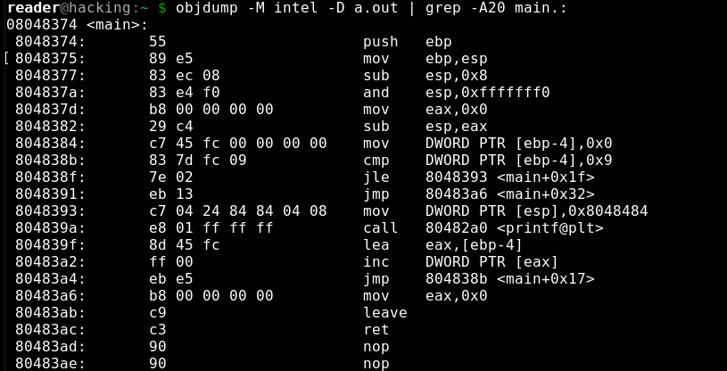
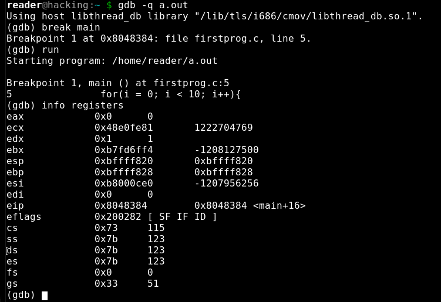

#Assembly & Disassembly

**Note:The following code and information will all be Linux based.**
##C and ASM
[C](https://en.cppreference.com/w/c/languageasm) is a complied language, which means that the C program is translated to machine instructions
which is then executed by the computer. C was developed to allow for cross platform programming between
the various types of CPU architectures, such as the x86, sparc, etc. Each of these architectures has 
a different set of machine code, and can because of this trying to develop programs in the native machine language of
each architecture is unreasonable. A complied language can be translated to whatever architecture is needed so
only one version of the program needs to be written(in theory) A complier(such as GCC) complies the language. There are many more steps in the processes but lets keep it simple for now. C is considered a high-level language
```C
#include <stdio.h>

int main(){
    int i;
    for(i = 0;i<10;i++){
        printf("Hello World");
    }
    return 0;
}
```
This is an example of a C program




Here is the main function of the above C program disassembled into machine and ASM instructions. The set of instructions on the right are the asm instructions. The values on the left are memory addresses shown in hexadecimal, and the information in the middle in hexadecimal is the actual machine language instructions This is in the Intel format of ASM as opposed to the ATT version. Its just easier to read honestly.

[objdump](https://man7.org/linux/man-pages/man1/objdump.1.html) is a a linux command which displays information about object files. The -D option disassembles all sections of the program and the -M allows for the selection of architecture. 

Debuggers are tools that can be used to put programs under a microscope, and go through them step by step, which allows them to be analyzed. The debugger I will be using here is called [GDB](https://www.sourceware.org/gdb/documentation/).



The above image shows the GDB debugger being run on the C program from earlier. A breakpoint, which is a way to stop the programs runtime at desired points, it set for the start of the main function, the command info registers displays the current state of all the CPU registers.

Registers are memory locations used by the CPU. They can hold values, addresses, instructions, etc. The first four registers are general purpose registers. They act as variables for the CPU while it is performing tasks. They are as follows:
* EAX - Accumulator
* ECX - Counter
* EDX - Data
* EBX - Base

The next four registers are pointers, or they hold addresses for use as source and destination. And they are as follows:
* ESP - Stack Pointer
* EBP - Base Pointer
* ESI - Source Index
* EDI - Destination Index

The EIP is the instruction pointer, this is the pointer thats shows the current instruction the CPU is executing. The EFlags register is used for comparisons. Flags are like an indicator to the state of events the CPU is seeing. These flags can indicate things like if there is a carried bit after an operation (CF) or if interrupts are enabled (IF), or even if an operation resulted in a zero (ZF). There are other flags that exists, most of which are conditions that are result of arithmetic operations.

[ASM](references/ASM_Reference.pdf) also called assembly is a low level language and represents actual machine language instructions. Within ASM you can see addresses, registers, bytes, and operations that a processor is performing. This is important for reverse-engineering as here in assembly we can put a program under a microscope and evaluate every little thing it is doing, and with the right tools, find out why its doing it. Linked on ASM is an x86 assembly reference from Oracle.